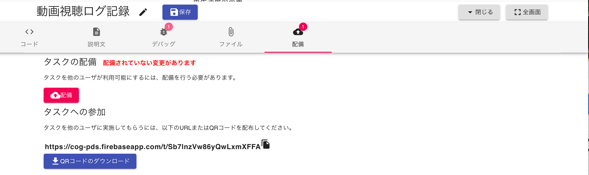

# Deployment

Deployment
タスク編集画面の 保存 ボタンを押すと、タスクのコード [JavaScript](JavaScript.md) や 説明 [Markdown](Markdown.md) がgoemon.cloudサーバに保存されますが、保存ボタンだけではこれらの情報はタスクの利用者から見える画面には反映されません。
変更を利用者の画面にも反映したい場合は、配備 タブより、**配備 ボタン**を押してください。

このボタンを押すと、利用者の画面にも変更が反映されます。**タスクへの参加** にあるURLやQRコードを利用者に渡して、タスクを実施してもらってください。

---

← 戻る: [タスクの作成](タスクの作成.md) | [GoodBrainアプリで脳波データを取得](GoodBrainアプリで脳波データを取得.md)