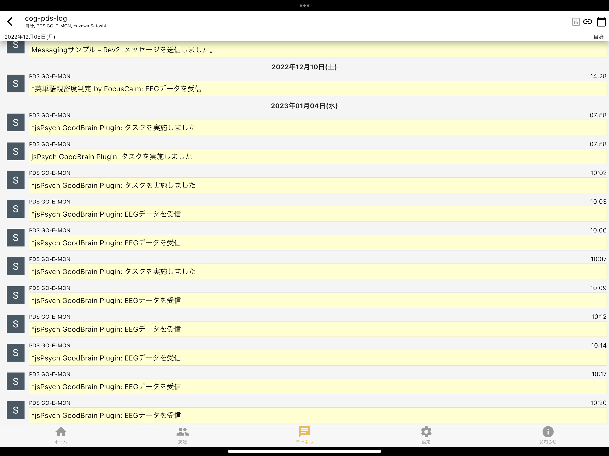

# GoodBrainアプリで脳波データを取得

GoodBrainアプリで脳波データを取得
ハコスコ社が提供するGoodBrainアプリ(iOS https://apps.apple.com/jp/app/goodbrain/id1481444268 )の脳波計測機能を利用すると、GO-E-MONでさまざまなタスクを表示しながら、FocusCalm( https://focuscalm.com/ )などのEEGヘッドセットで得たデーを保存、利用することができます。
jsPsych GoodBrain Plugin https://github.com/goemon-cloud/goemon-goodbrain/tree/main/jspsych を利用すると容易にGoodBrainアプリとの連携を記述することができます。このページでは、jsPsych GoodBrain Pluginの使用方法を説明します。

**ご注意** GoodBrainアプリは標準ではGO-E-MON連携機能は有効化されていません。GoodBrain連携機能を利用したい場合は、[お問い合わせ](お問い合わせ.md)フォームからお問い合わせください。

# サンプルタスク
このページで解説するサンプルを実装したタスクは https://goemon.cloud/t/zEK4OcDEz6QcV1QATGdy にあります。[タスクのコピー](タスクのコピー.md)をして内容を確認することができます。

# jsPsych GoodBrain Pluginを使う準備
GO-E-MONでjsPsych GoodBrain Pluginを使うためには、まず、以下を参考にjsPsych Plugin関連ファイルを準備する必要があります。作成したいタスクに応じて、Survey Pluginやhtml-keyboard-response Pluginなどを準備してください。

- [チュートリアル2: jsPsychを使ったタスク] を参考にhtml-keyboard-response Pluginなどを準備する
- [jsPsych Survey Plugin関連ファイルのアップロード]を参考にSurvey Pluginを準備する

jsPsychのPluginを準備したら、GoodBrain Pluginをインストールします。

1. URL https://github.com/goemon-cloud/goemon-goodbrain/tree/main/jspsych からjspsych-gb.cssファイルとjspsych-gb.jsファイルをダウンロードし、ファイル([Files](Files.md))タブにアップロードする。
2. URL https://jquery.com/download/ から *Download the compressed, production jQuery X.X.X* をダウンロードし、ファイル([Files](Files.md))タブにアップロードする。この.jsファイルの優先度は 1000 とする。

# コードの記述
タスクとして実行する [JavaScript](JavaScript.md) コードを記述します。ここでは、StroopタスクをjsPsychで実装した例  https://softdev.ppls.ed.ac.uk/online_experiments/example_code/stroop_functions.html をベースに、Stroopタスク実施中の脳波測定タスクを実装しています。GO-E-MON, GoodBrain固有の変更点には **// goemon:** というコメントを記載しています。

```javascript
   // goemon: jsPsych関係の関数・オブジェクトをスクリプトで利用できるようにします。
   const initJsPsych = context.getGlobal('initJsPsych');
   // Plugin typeごとに以下を定義
   const jsPsychHtmlKeyboardResponse = context.getGlobal('jsPsychHtmlKeyboardResponse');
   const jsPsychHtmlButtonResponse = context.getGlobal('jsPsychHtmlButtonResponse');
   const jsPsychInstructions = context.getGlobal('jsPsychInstructions');
   // goemon: GoodBrain連携
   const JSPsychGB = context.getGlobal('_JSPsychGB');
   const GBLogger = context.getGlobal('_GBLogger');
   const goodbrain = context.getGlobal('_goodbrain');
 
   // goemon: jsPsychの表示領域を作る
   const expRoot = $('<div></div>').attr('id', 'exp_main').css({
     height: '80vh',
   });
   context.root.append(expRoot);
 
   // goemon: GoodBrain用のURLをコンソールに表示
   console.log('GoodBrain URL: ' + 'goodbrain://goemon?task=' + encodeURIComponent(context.getGlobal('window').location.href));
 
   /* initialize jsPsych */
   var jsPsych = initJsPsych({
     // goemon: jsPsych用に準備した表示領域に刺激を表示することを示す
     display_element: 'exp_main',
     // goemon: 結果を送信するため、on_finishハンドラには以下のようなコードを記述する。
     // 出力内容は [デバッグ]タブで確認できる。
     // `context.finish('人間が読める結果サマリ', 保存するデータ)`
     on_finish: function(data) {
       context.finish(`タスクを実施しました`, {
         data: data.values(),
         variables: jsPsych.getAllTimelineVariables(),
       }, {
         onCompleted: () => {
           // goemon: アプリを終了
           goodbrain.stop();
         },
       });
     }
   });
 
   // Stroop with functions https://softdev.ppls.ed.ac.uk/online_experiments/example_code/stroop_functions.html
   // the colours are also the words ....
   var colours = ['red', 'green', 'blue', 'yellow'];
 
   var n_trials = 30;
 
   // returns a JavaScript object with { text: ...., colour: .... }
   // using a random colour (text is the same as colour)
   function congruent() {
     // pick a colour ....
     // (when we're only picking one, with/without replacement doesn't matter)
     var colour_list = jsPsych.randomization.sampleWithReplacement(colours,1);
     // this returns a list with one item, so we select the first (only) item
     return { text: colour_list[0], colour: colour_list[0], condition: 'congruent' };
   }
 
   // returns a JavaScript object with { text: ...., colour: .... }
   // using a random colour (text is different to colour)
   function incongruent() {
     // pick two colours without replacement (i.e. they will be different)
     var colour_list = jsPsych.randomization.sampleWithoutReplacement(colours,2);
     // this returns a list with two item, we select these out
     return { text: colour_list[0], colour: colour_list[1], condition: 'incongruent' };
   }
 
   // these are in HTML, so <br> means "line break"
   var instructions = {
     type: jsPsychInstructions,
     pages: [
       "Welcome to the experiment.<br>Press Space to continue.",
       "In this experiment you will be presented with the words blue, red, yellow and green.<br>Press Space to continue.",
       "As soon as you see a new word, press its first letter.<br>For example, press the B key for blue.<br>Press Space to continue.",
       "Try to answer as quickly as you can!<br>Press Space to start the experiment.",
     ],
     key_forward: ' ',
     show_clickable_nav: true,
   };
 
   var fixation = {
     type: jsPsychHtmlKeyboardResponse,
     stimulus: '+',
     trial_duration: 500,
     response_ends_trial: false
   };
 
   // blank (ITI stands for "inter trial interval")
   var iti = {
     type: jsPsychHtmlKeyboardResponse,
     stimulus: '',
     trial_duration: 250,
     response_ends_trial: false
   };
 
   var trials = [instructions];
   // repeat this code n_trials times
   for (var i=0; i<n_trials; i++) {
     var values;
     // Math.random returns a random number between 0 and 1. Use this to decide
     // whether the current trial is congruent or incongruent.
     if (Math.random() < 0.5) {
       values = congruent();
     } else {
       values = incongruent();
     }
     var trial = {
       type: jsPsychHtmlButtonResponse,
       stimulus: '<p style="color: '+values.colour+'">'+values.text+'</p>',
       // 'choices' restricts the available responses for the participant
       choices: ['r','g','b','y'],
       data: values
     };
     trials.push(iti);
     trials.push(fixation);
     trials.push(trial);
   }
 
   // goemon: GoodBrainのEEGデータをGO-E-MONにログ送信するための処理
   const gbLogger = new GBLogger(context, {
     maxInterval: 1000 * 60 * 3, // 3 minutes
     maxSize: 32, // 32 records
   });
 
   // goemon: GoodBrain連携の初期化
   const gb = {
     type: JSPsychGB,
     startMessage: '<div style="font-size: 0.9em; font-weight: normal; width: 95vw;">TEST</div>',
     startInterval: 5000 + 500,
     onReceived: function(meta, data) {
       // goemon: EEGデータの受信: dataに値が格納される
       // context.log("Invalid EEG data", { detail: data });
       // context.log("EEG値が安定", { detail: data });
       // context.log("EEG", { detail: data });
       gbLogger.log({
         meta: meta,
         data: data,
       });
     },
   };
 
   // goemon: 上部メニューを隠す
   context.appMenu.hide();
   jsPsych.run([gb].concat(trials));

```
# 動作確認
`JSPsychGB` プラグインはGoodBrainアプリ内でのみ動作可能です。PCブラウザで動作確認する場合には、最終行にある`jsPsych.run([gb](gb.md).concat(trials))` の代わりに`jsPsych.run(trials)`として実行してください。

GoodBrainアプリでの動作を確認する場合は、以下の手順を実施します。

1. 配備([Deployment](Deployment.md))タブより、タスクの配備を実施する。
2. GoodBrainのタスク実行URLを取得する。記述したタスクをPCブラウザ上で実行するとデバッグ([Debugger](Debugger.md))タブに`GoodBrain URL: goodbrain://goemon?task=https%3A%2F%2Fgoemon.cloud%2Ft%2FzEK4OcDEz6QcV1QATGdy` のようなURLが表示されますので、これをテキストファイル等に保存しておきます。
3. タスク実行URLのQRコードを作成する。 https://www.qr-code-generator.com/ のようなサービスを使って、2. のURLをQRコードにします。
4. GoodBrainアプリをインストールしたiOSアプリより 3. のQRコードを読み込む。

すると、GoodBrainアプリが起動しますので、画面の指示に従ってEEGヘッドセットを接続、GO-E-MONタスクを実行します。

# データの分析
タスクを実行すると他のタスクと同様にタスク提供者のPersonaryに実施記録が格納されます。本サンプルでは、実施記録とは別のログとして、脳波の生データも記録されます。Personaryを自身のアカウントと紐付けていると、以下のように実施記録が送信されます。Personaryのデータ分析については[Jupyter NotebookでPersonaryのデータを分析する](Jupyter_NotebookでPersonaryのデータを分析する.md)を参照してください。



「EEGデータを受信」というアイテムにEEGデータが記録されます。EEGの値は250Hzで記録され、FocusCalmの場合は1チャンネルのセミコロンで区切られた値として記録されます。

