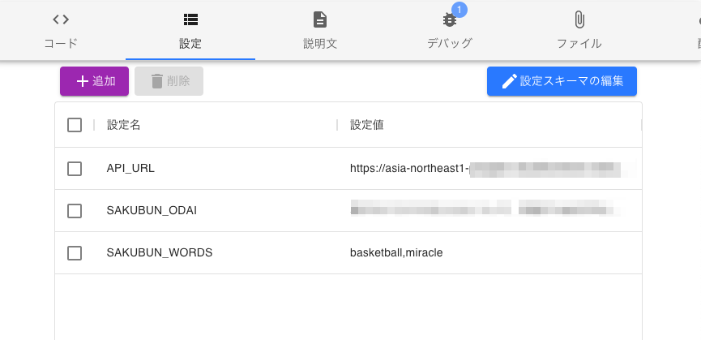

# Param

Param
タスクの動作は 設定 タブでカスタマイズできるようにコードを記述することができます。設定タブには **設定名 と 設定値** の組み合わせを登録することができ、この内容をスクリプトから読み出すことができます。

タスク設定はスクリプトから [contextオブジェクト](contextオブジェクト.md) を介してアクセスすることができます。

設定タブでは以下のパラメータを設定することができます。

## GOEMON_GENERATE_ID_FOR_DISTRIBUTOR

仮名IDでのユーザの識別可能範囲を制御することができる真偽値(true/false)です。詳細は [context.pseudonymUserIdプロパティ](context.pseudonymUserIdプロパティ.md) を参照してください。

## GOEMON_AUTO_START

一度実行したタスクを自動的に開始するように設定できる真偽値(true/false)です。

## GOEMON_GROUP_IDS

実験群を分ける場合などに定義します。 *A,B,C* などと群ラベルをカンマ区切り文字列として与えると、ユーザに対してこれらのラベル数ができるだけ均等になるように割り振ります。詳細は [context.groupIdプロパティ](context.groupIdプロパティ.md) を参照してください。

## GOEMON_EMAIL_ALLOWLIST

ユーザをEメールアドレスにより制限する場合に定義します。@hogehoge.com;@fugafuga.com などとEメールアドレスのドメインをセミコロン区切り文字列として与えると、そのドメイン外のユーザに対しては再ログインするよう促すメッセージが表示されます。
