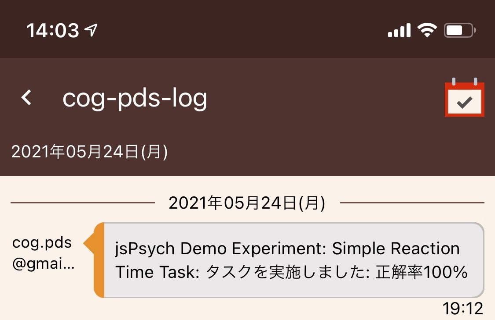

# contextオブジェクト

contextオブジェクト
cogtask.me固有の機能にアクセスすることができます。

## rootプロパティ
タスクの表示領域を示すjQueryオブジェクトです。以下のように画面に表示したい要素を追加することで、タスクに必要な画面表示を実現することができます。

```JavaScript
 const panel = $('<div></div>')
     .css('width', '90%')
     .css('border', '1px solid #555')
     .css('margin', 'auto')
     .css('padding', '2em');
 // panelを表示領域に追加
 context.root.append(panel);

```
## taskURLプロパティ
このタスクのURLを示す文字列です。 <https://goemon.cloud/t/{タスクID}> の形式となります。

## paramプロパティ
タスクの設定を格納したオブジェクトです。以下のように設定名で項目を参照することができます。設定は [設定タブ](設定タブ.md) から行うことができます。

```JavaScript
 const url = context.param.API_URL;

```
## pseudonymUserIdプロパティ
[context.pseudonymUserIdプロパティ](context.pseudonymUserIdプロパティ.md) を参照してください。

## groupIdプロパティ
[context.groupIdプロパティ](context.groupIdプロパティ.md) を参照してください。

## userEmailDomainプロパティ
実行中のユーザのEメールアドレスにおけるドメイン名を取得するためのプロパティです。ユーザのEメールアドレスが hogehoge-fugafuga@gmail.com の場合には、gmail.com となります。

## searchプロパティ
このタスクを開く際に指定されたURL中のクエリパラメータを取得します。オブジェクトは URLSearchParams <https://developer.mozilla.org/ja/docs/Web/API/URLSearchParams> の形式で提供されます。

```JavaScript
 // ブラウザで タスクのURL?a=PARAMETER_A&b=PARAMETER_B を開いた場合
 const param1 = context.search.get('a');  // param1にはPARAMETER_Aが格納される
 const param2 = context.search.get('b');  // param2にはPARAMETER_Bが格納される

```
## userStorageプロパティ
[context.userStorageプロパティ](context.userStorageプロパティ.md) を参照してください。

## messagingプロパティ
[context.messagingプロパティ](context.messagingプロパティ.md) を参照してください。

## getGlobal(propertyName)メソッド
JavaScriptのwindowオブジェクトから指定されたプロパティを取得します。

```JavaScript
 // おまじない: jsPsychオブジェクトをスクリプトで利用できるようにします。
 const jsPsych = context.getGlobal('jsPsych');

```
## getFileURL(filename)メソッド
ファイル([Files](Files.md))タブ中のファイルを参照するためのURLを取得します。

## finish(summary, detail, options)メソッド
タスクを終了する際に呼び出します。引数にはログとして記録するデータを格納します。summaryはPersonaryの画面に表示する文字列を、detailはJSON文字列化可能なオブジェクトを指定します。これらのデータはPersonary経由でアクセスすることができます。
optionsパラメータによって終了時の動作を定義することができます。optionsパラメータに関する詳細は [終了時のoptionsパラメータ](終了時のoptionsパラメータ.md) を参照してください。

```JavaScript
 context.finish(`タスクを実施しました: 正解率${accuracy}%`, { detail: [1, 2, 3, 4] })

```
Personaryには *タスクのタイトル: summary* という形式でログが保存されます。



## log(summary, detail)メソッド
タスクによるログを出力する際に呼び出します。*finish(summary, detail, options)* との違いは、タスクの実行は終了せず継続する点です。多くのデータをログとして記録する必要があるときなどに、タスク実行中にデータを保存するために利用します。
summary, detailパラメータについては *finish(summary, detail, options)* の説明を参照してください。

## abort(options)メソッド
タスクを中断する際に呼び出します。*finish(summary, detail, options)*との違いは、ログ送信を行わずに終了する点です。optionsパラメータによって終了時の動作を定義することができます。optionsパラメータに関する詳細は [終了時のoptionsパラメータ](終了時のoptionsパラメータ.md) を参照してください。


---

← 戻る: [JavaScript](JavaScript.md) | [チュートリアル2: jsPsychを使ったタスク](チュートリアル2_jsPsychを使ったタスク.md) | [Param](Param.md) | [context.messaging.setScheduleメソッド.options.scriptパラメータ](context.messaging.setScheduleメソッド.options.scriptパラメータ.md)