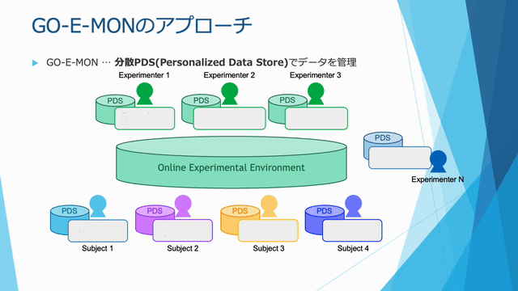

# GO-E-MON ユーザーマニュアル

GO-E-MON（GOod Experiment for Mankind Online）へようこそ。

## GO-E-MONとは

GO-E-MONは、パーソナルデータストアに対応した、認知科学・心理学の実験や調査を実施するためのオンライン実験プラットフォームです。研究者が簡単に実験を実装、配信し、参加者がウェブブラウザから実験に参加できる環境を提供します。収集された情報は、実験実施者および参加者のパーソナルデータストアに保存されるため、データを本人同意のもとで安全に管理することができます。

従来、実験実施者が得たデータを別の研究者に提供する場合、個人情報の取り扱いやデータの匿名化など、多くの障壁がありました。これらの障壁は長期にわたる縦断的な研究を困難にしていました。

GO-E-MONは、参加者それぞれにパーソナルデータストアを持ってもらい、実験データを保存可能にすることでこの課題の解決をはかります。

実験参加者がGO-E-MONで配信された実験タスクを実行すると、その実行結果は、実験実施者と実験参加者双方のパーソナルデータストアに格納されます。実験実施者は従来と同様に自身のパーソナルストアに格納されたデータを分析し、研究成果につなげます。加えて、実験参加者が自身の意思で別の実験実施者に過去のデータを提供可能にすることで、縦断的な研究を実現することができるようになります。

## GO-E-MONでできること

- 実験タスクの作成と管理
- パーソナルデータストアへの結果データの保存
- jsPsychによる認知課題の実装
- SurveyJSを用いたアンケートの実施

実験の開始方法については [Getting Started](./docs/getting-started.html) をご覧ください。

## 参考文献

GO-E-MONシステムの詳細については、以下の論文をご参照ください：

Yazawa, S., Sakaguchi, K., & Hiraki, K. (2021). GO-E-MON: A New Online Platform for Decentralized Cognitive Science. *Big Data and Cognitive Computing*, 5(4), 76. [https://doi.org/10.3390/bdcc5040076](https://doi.org/10.3390/bdcc5040076)