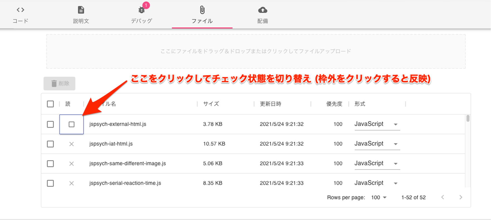

# jsPsychのスクリプト読み込み設定

jsPsychのスクリプト読み込み設定
*TBD*
ファイル [Files](Files.md) タブにjsPsychのスクリプトファイルが格納されています(jsPsychタスクをコピーした場合)
スクリプトはデフォルトでは jspsych.js, jspsych-preload.js , jspsych-html-keyboard-response.js, jspsych-image-keyboard-response.js のみが読み込まれます。
読み込みたいスクリプトの *読み込み* 欄にチェックを入れると、読み込まれるようになります(下図)
jsPsych使用上の説明などはコード中のコメント (// コメント) を参照してください

[jsPsychが見つからないエラー](jsPsychが見つからないエラー.md)
