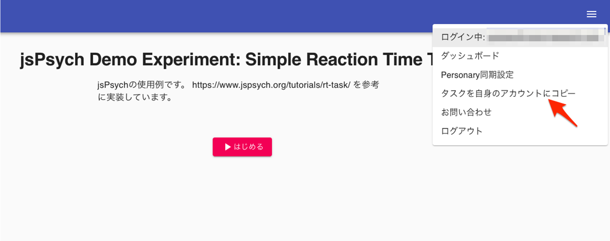
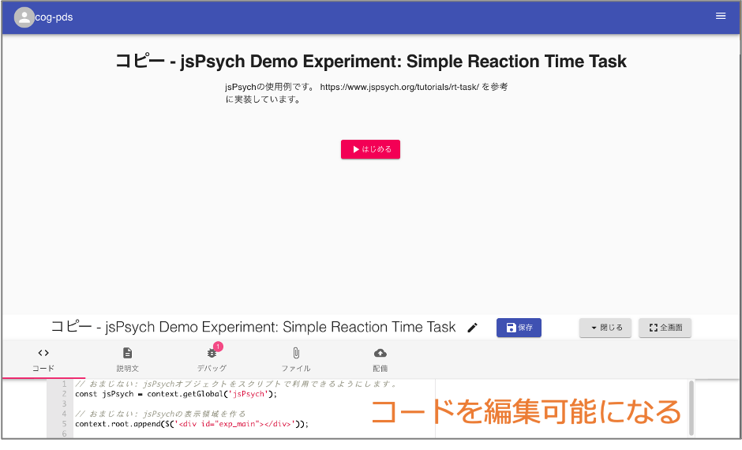

# タスクのコピー

タスクのコピー
タスクは自身のアカウントにコピーすることで編集し、アレンジを加えることができます。コピーしたタスクを公開することも可能です。

タスクをコピーするには、画面右上のメニューから **タスクを自身のアカウントにコピー** を選択します。

しばらく待つと、自身のアカウントにタスクがコピーされ、編集可能になります。

---

← 戻る: [タスクの例](タスクの例.md) | [タスクを他のユーザが配信できるようにする](タスクを他のユーザが配信できるようにする.md) | [チュートリアル3: jsPsychによる質問紙作成](チュートリアル3_jsPsychによる質問紙作成.md) | [GoodBrainアプリで脳波データを取得](GoodBrainアプリで脳波データを取得.md)