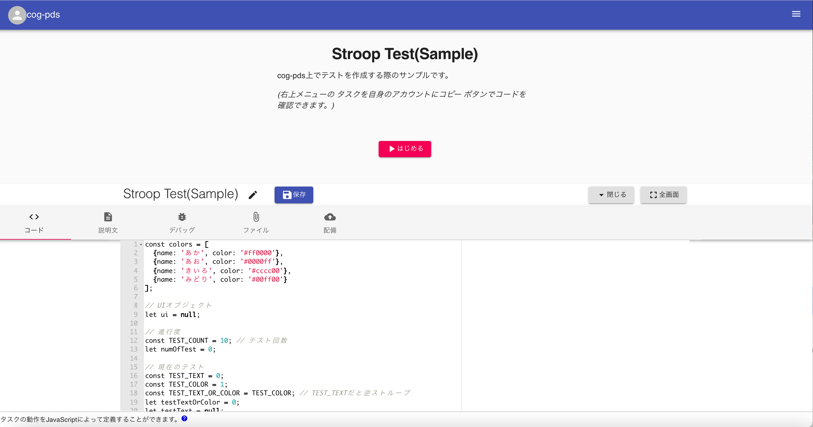

# タスクの作成

タスクの作成
自身が所有者であるタスクを開くと、編集ウィンドウが表示されます。タスクの開き方は [タスクの管理](タスクの管理.md) を参照してください。

編集ウィンドウは以下のタブを持ちます。各タブの説明は以下のリンクを参照してください。

- コード([JavaScript])タブ
- 説明文([Markdown])タブ
- デバッグ([Debugger])タブ
- ファイル([Files])タブ
- 配備([Deployment])タブ

これらの機能を使ってどのようにタスクを作成するかは以下のチュートリアルを参照してください。

- [チュートリアル1: 簡単なアンケート]
- [チュートリアル2: jsPsychを使ったタスク]
