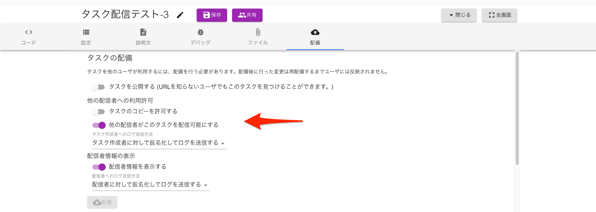
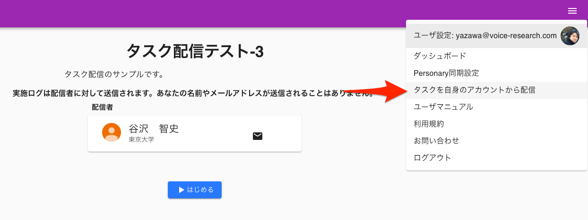

# タスクを他のユーザが配信できるようにする

タスクを他のユーザが配信できるようにする
GO-E-MONタスクはタスクを作成、配信することができますが、ある作成者が作成したタスクを別の配信者が配信することができます。

## タスクの配信を許可する
自身が作成したタスクを他のユーザが配信できるようにするには、**他の配信者がこのタスクを配信可能にする**スイッチをオンにします。

> タスクを配信可能にするためには[* 配信者情報を表示する] スイッチをオンにし、作成者自身の連絡先等の情報を開示する必要があります。

## 他のユーザが作成したタスクを配信する
他のユーザが作成したタスクを自身のタスクとして配信するためには、そのタスクを開いた状態で**タスクを自身のアカウントから配信**をクリックします。

すると、自身のタスクとしてタスクを配信可能になります。
[タスクのコピー](タスクのコピー.md)(タスクのコピー.md) とは異なり、スクリプトの変更はできません。
配信元のスクリプトによっては、 [Param](Param.md)(Param.md) や [Files](Files.md)(Files.md) の変更によるカスタマイズを想定しています。
配信元のタスクに変更があると配信タスクの内容も変化します。 実験配信者は配信ユーザのものとなるため、 [context.pseudonymUserIdプロパティ](context.pseudonymUserIdプロパティ.md)(context.pseudonymUserIdプロパティ.md) のような値は配信ユーザの情報をもとに決定されます。
