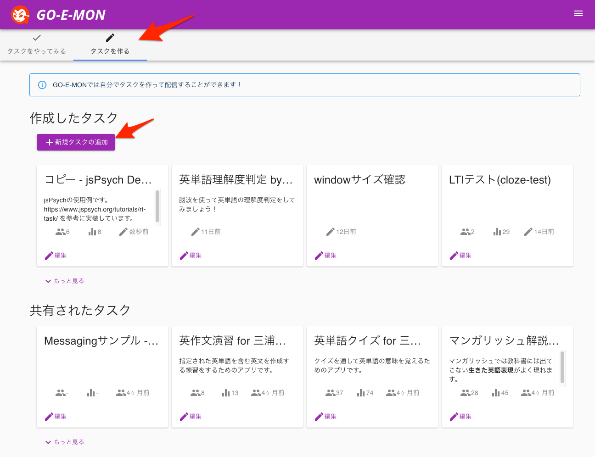
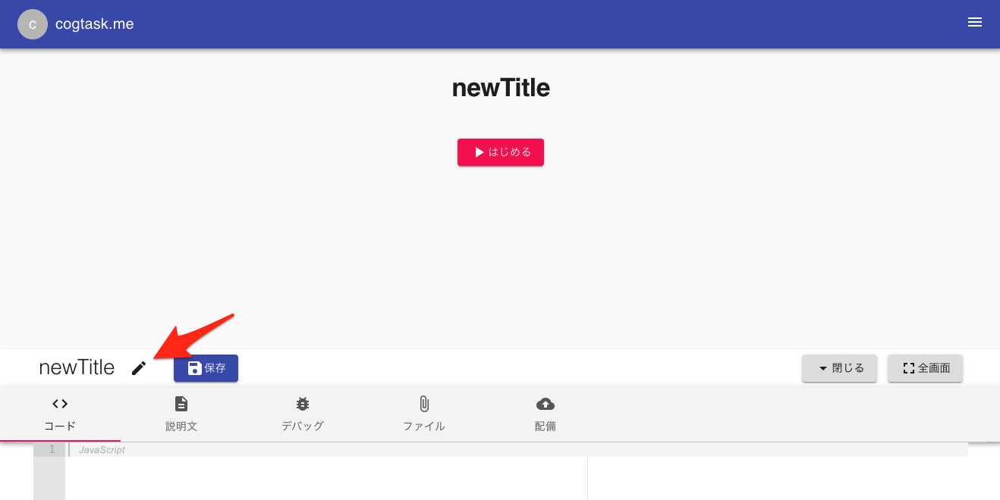
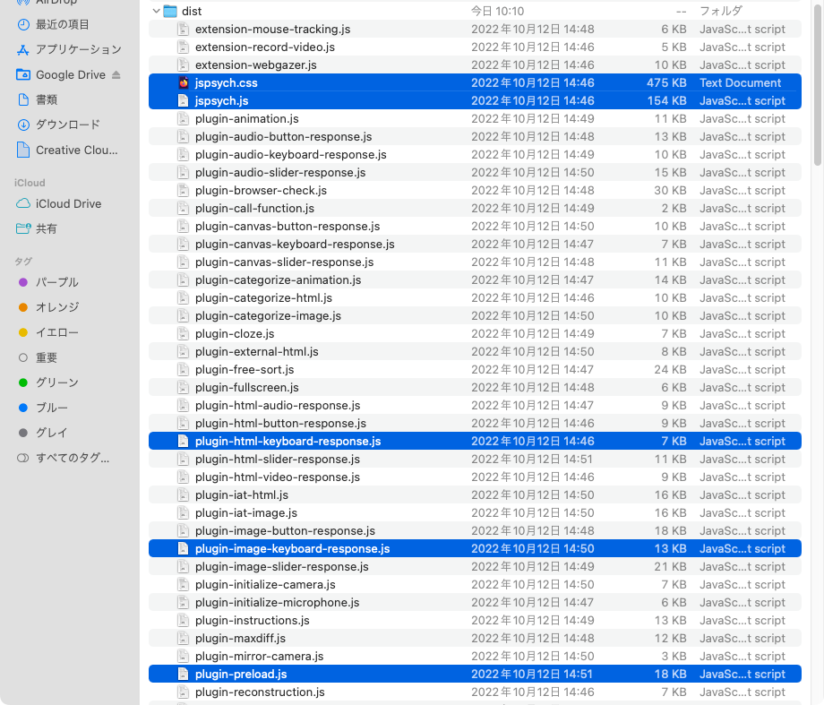
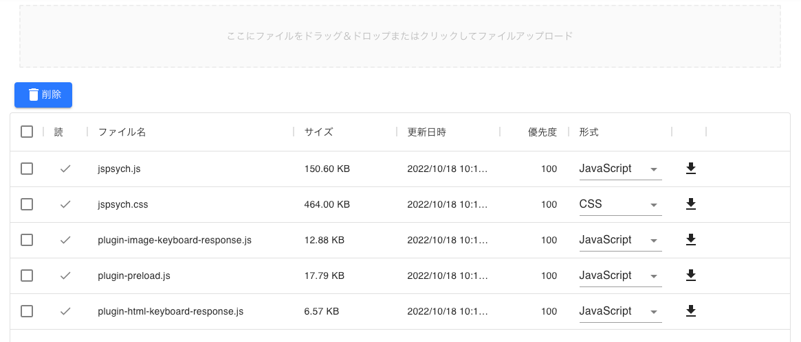
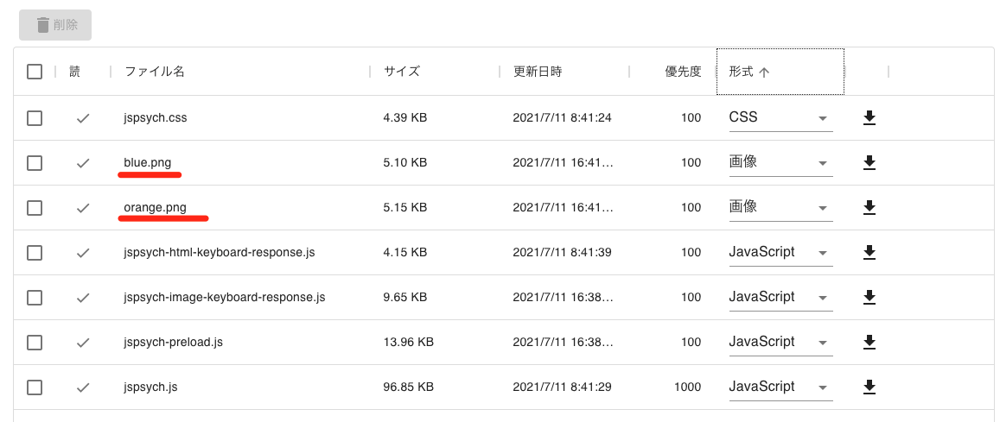
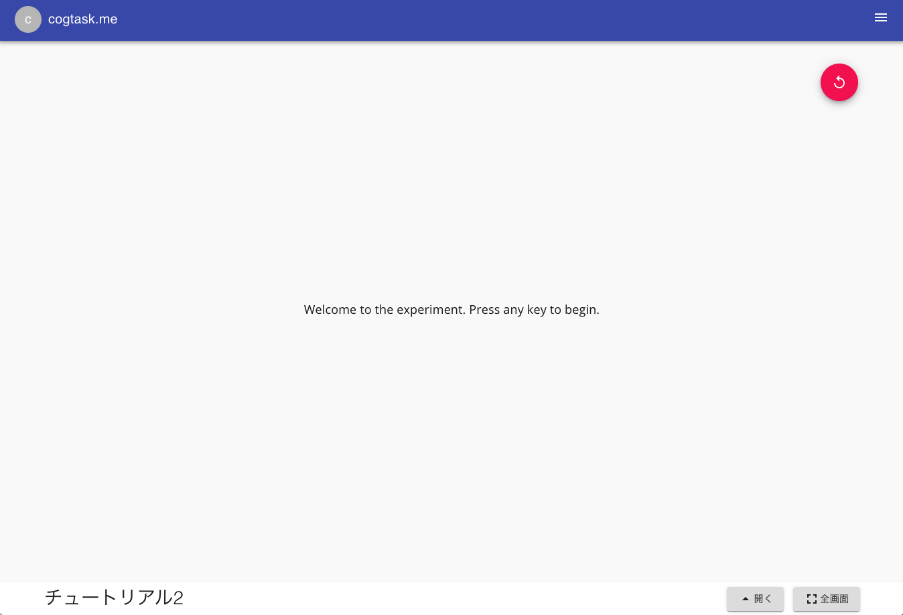
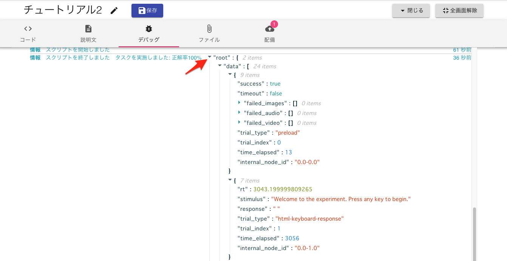
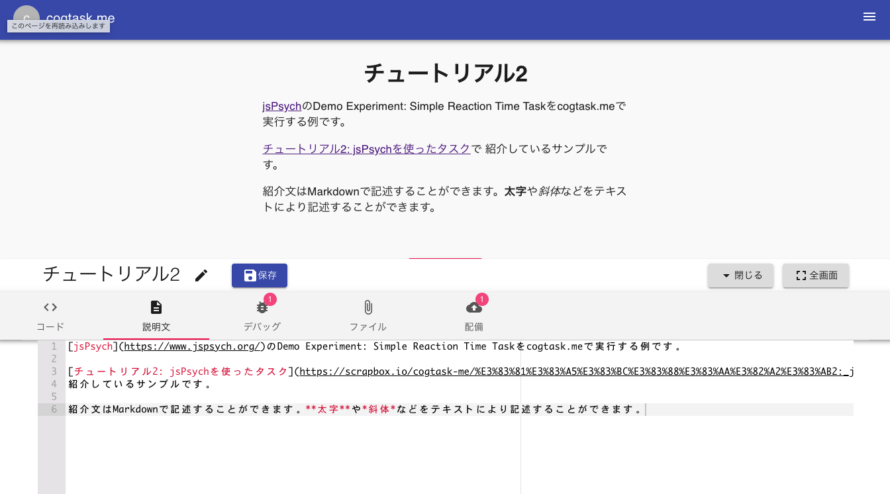
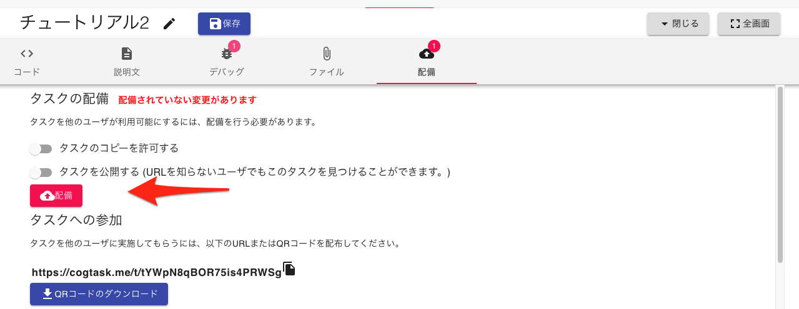

# チュートリアル2: jsPsychを使ったタスク

チュートリアル2: jsPsychを使ったタスク
JavaScriptでタスクを記述する場合、 [jsPsych](jsPsych.md) のようなライブラリを用いることで、既存のコードを再利用できるなどの恩恵を受けることができます。そこで、jsPsychのTutorials > Demo Experiment: Simple Reaction Time Task <https://www.jspsych.org/v8/tutorials/rt-task/> をGO-E-MONで実施するチュートリアルを紹介します。
基本的な流れは [チュートリアル1: 簡単なアンケート](チュートリアル1_簡単なアンケート.md) と同様です。

# 作成例
実際の動作を確認するためのサンプルです。
<https://goemon.cloud/t/tYWpN8qBOR75is4PRWSg>

# タスクの作成
GO-E-MONダッシュボード <https://goemon.cloud> にアクセスし、*タスクを作る*をクリックし、*新規タスクの追加* ボタンをクリックします。



# タスク名の設定
newTitleというタスクが作成されますので、タスク名を変更します。タスク名右の編集ボタンをクリックします。

タスク名を入力します。タスク名はENTERキーで確定できます。


# ライブラリの追加
ここから、 <https://www.jspsych.org/v8/tutorials/rt-task/> にしたがってコードを記述していくのですが、jsPsychを使用するには、*Part 1: Creating a blank experiment* に記載されているように、jsPsychとして配布されているコードをロードするようにGO-E-MONに指示する必要があります。これは以下の手順で実施します。
- jsPsychのパッケージ(Dist archive)をダウンロードする <https://github.com/jspsych/jsPsych/releases>
  - <https://github.com/jspsych/jsPsych/releases/tag/jspsych%408.2.1> のDist archiveを例に解説します。
- jsPsychのパッケージに含まれるファイルのうち、必要なものをGO-E-MONのファイル([Files](Files.md))タブにアップロードする
- アップロードしたファイルの読み込み優先度を変更する

このチュートリアルでは、jsPsychのパッケージに含まれるファイルのうち、以下のファイルをアップロードします。
- dist/jspsych.css
- dist/jspsych.js
- dist/plugin-html-keyboard-response.js
- dist/plugin-image-keyboard-response.js
- dist/plugin-preload.js


これらのファイルをファイル([Files](Files.md))タブにドラッグ＆ドロップします。すると、現在のタスクに以下のようにファイルが追加されます。



左から2番目の *読み込み* がチェックされている項目はタスクの実行前に自動的にブラウザに読み込まれます。
jsPsychでは、jspsych.jsが他の.jsファイルよりも先に読み込む必要があるので、 *優先度* の項目をクリックし、他のファイルよりも大きな値(例えば1000)を設定します。*優先度* は大きい値であれば先に読み込まれます。


## 刺激の追加
jsPsychで表示する画像や動画、音声もファイル([Files](Files.md))タブにアップロードすることで、JavaScriptから読み込むことが可能になります。ここでは、jsPsychパッケージ中の examplesフォルダ内のimgフォルダにある blue.png とorange.pngを追加します。




# コードの記述
タスクとして実行する [JavaScript](JavaScript.md) コードを記述します。ここでは、チュートリアル <https://www.jspsych.org/tutorials/rt-task/> の*The final code* 相当のコードを記述します。

以下は *The final code* をGO-E-MON用に変更したものです。変更点には **// goemon:** というコメントを記載しています。

```javascript
 // goemon: jsPsych関係の関数・オブジェクトをスクリプトで利用できるようにします。
 const initJsPsych = context.getGlobal('initJsPsych');
 // Plugin typeごとに以下を定義
 // チュートリアル以外のプラグインを使用したい場合は、 plugin-(プラグイン名).js を Files タブにアップロードし、
 // 以下のように const jsPsych(プラグイン名) = context.getGlobal('jsPsych(プラグイン名)');
 const jsPsychPreload = context.getGlobal('jsPsychPreload');
 const jsPsychHtmlKeyboardResponse = context.getGlobal('jsPsychHtmlKeyboardResponse');
 const jsPsychImageKeyboardResponse = context.getGlobal('jsPsychImageKeyboardResponse');
 
 // goemon: jsPsychの表示領域を作る
 const expRoot = $('<div></div>').attr('id', 'exp_main').css({
   height: '80vh',
 });
 context.root.append(expRoot);
 
 /* initialize jsPsych */
 var jsPsych = initJsPsych({
   // goemon: jsPsych用に準備した表示領域に刺激を表示することを示す
   display_element: 'exp_main',
   // goemon: 結果を送信するため、on_finishハンドラには以下のようなコードを記述する。
   // 出力内容は [デバッグ]タブで確認できる。
   // `context.finish('人間が読める結果サマリ', 保存するデータ)`
   on_finish: function(data) {
     var trials = jsPsych.data.get().filter({task: 'response'});
     var correct_trials = trials.filter({correct: true});
     var accuracy = Math.round(correct_trials.count() / trials.count() * 100);
 
     context.finish(`タスクを実施しました: 正解率${accuracy}%`, {
       data: data.values(),
     });
   }
 });
 
 /* create timeline */
 var timeline = [];
 
 /* preload images */
 var preload = {
   type: jsPsychPreload,
   // goemon: ファイルを参照する際は `context.getFileURL(filename)` を使います。
   // filenameには ファイル タブ中の対象ファイルのファイル名を指定します。
   images: [context.getFileURL('blue.png'), context.getFileURL('orange.png')]
 };
 timeline.push(preload);
 
 /* define welcome message trial */
 var welcome = {
   type: jsPsychHtmlKeyboardResponse,
   stimulus: "Welcome to the experiment. Press any key to begin."
 };
 timeline.push(welcome);
 
 /* define instructions trial */
 var instructions = {
   type: jsPsychHtmlKeyboardResponse,
   stimulus: `
     <p>In this experiment, a circle will appear in the center
     of the screen.</p><p>If the circle is <strong>blue</strong>,
     press the letter F on the keyboard as fast as you can.</p>
     <p>If the circle is <strong>orange</strong>, press the letter J
     as fast as you can.</p>
     <div style='width: 700px;'>
     <div style='float: left;'></img>
     <p class='small'><strong>Press the F key</strong></p></div>
     <div class='float: right;'></img>
     <p class='small'><strong>Press the J key</strong></p></div>
     </div>
     <p>Press any key to begin.</p>
   `,
   post_trial_gap: 2000
 };
 timeline.push(instructions);
 
 /* test trials */
 var test_stimuli = [
   // goemon: ファイルを参照する際は `context.getFileURL(filename)` を使います。
   { stimulus: context.getFileURL("blue.png"),  correct_response: 'f'},
   { stimulus: context.getFileURL("orange.png"),  correct_response: 'j'}
 ];
 
 var fixation = {
   type: jsPsychHtmlKeyboardResponse,
   stimulus: '<div style="font-size:60px;">+</div>',
   choices: "NO_KEYS",
   trial_duration: function(){
     return jsPsych.randomization.sampleWithoutReplacement([250, 500, 750, 1000, 1250, 1500, 1750, 2000], 1)[0];
   },
   data: {
     task: 'fixation'
   }
 };
 
 var test = {
   type: jsPsychImageKeyboardResponse,
   stimulus: jsPsych.timelineVariable('stimulus'),
   choices: ['f', 'j'],
   data: {
     task: 'response',
     correct_response: jsPsych.timelineVariable('correct_response')
   },
   on_finish: function(data){
     data.correct = jsPsych.pluginAPI.compareKeys(data.response, data.correct_response);
   }
 };
 
 var test_procedure = {
   timeline: [fixation, test],
   timeline_variables: test_stimuli,
   repetitions: 5,
   randomize_order: true
 };
 timeline.push(test_procedure);
 
 /* define debrief */
 
 var debrief_block = {
   type: jsPsychHtmlKeyboardResponse,
   stimulus: function() {
 
     var trials = jsPsych.data.get().filter({task: 'response'});
     var correct_trials = trials.filter({correct: true});
     var accuracy = Math.round(correct_trials.count() / trials.count() * 100);
     var rt = Math.round(correct_trials.select('rt').mean());
 
     return `<p>You responded correctly on ${accuracy}% of the trials.</p>
       <p>Your average response time was ${rt}ms.</p>
       <p>Press any key to complete the experiment. Thank you!</p>`;
 
   }
 };
 timeline.push(debrief_block);
 
 // goemon: 上部メニューを隠す
 context.appMenu.hide();
 jsPsych.run(timeline);

```
jsPsychのコードをcogtask.me用で動作させる場合、以下の点を変更する必要があります。
- **jsPsychオブジェクトの取得** ... jsPsychのタイムラインを定義する前に、 [contextオブジェクト](contextオブジェクト.md)の *getGlobal(propertyName)メソッド* を用いてjspsych.js等が定義したjsPsychオブジェクトを取得しておく必要があります。
- **jsPsych用の表示領域の作成** ... jsPsychが画面表示をする領域を[jQuery](jQuery.md)等を用いて明示的に作成します。これを指定しないと、タスク実行時にコードエディタなどが画面から消去されてしまいます。
- **画像リソース等のURL解決** ... jsPsychからファイル([Files](Files.md))タブにアップロードした画像ファイル等を参照する際は [contextオブジェクト](contextオブジェクト.md)の *getFileURL(filename)メソッド* によってファイルのURLを取得し、jsPsychに与える必要があります。
- **終了時のログ送信処理** ... タスク終了時に  [contextオブジェクト](contextオブジェクト.md)の *finish(summary, detail)メソッド* によってログとして保存する情報を構築する必要があります。

## コードの実行
コードを記述したら、実行してみましょう。


チュートリアル1と異なり、はじめるボタンが押せるようになるまで少し時間がかかります。これは、jspsych.js等のファイルを事前に読み込んでいるためです。

*はじめる* を押して何も画面に表示されない場合は、編集ウィンドウの裏にテキストが表示されている可能性があります。
*閉じる* ボタンを押してみてください。


すると、以下のようにメッセージが確認できるはずです。


このチュートリアルはキーボードで操作する形式となっています。キーを押しても反応しない場合は、キーボードフォーカスを別のボタン等が持っている可能性がありますので、マウスでこのメッセージを一度クリックします。すると、キーボードの操作に反応するはずです。


もし、上記のように動作しない場合や、再度はじめから実行したい場合は、右上の再読み込みボタンを押します。

## コードの動作確認
タスクを最後まで実施したら、どのようなログが送信されたか確認してみましょう。*デバッグ*タブから確認することができます。




送信されたログは *スクリプトを終了しました* ログから内容を確認できます。
また、スクリプトの誤りなどでエラーが発生した場合は、デバッグタブから警告・エラーを確認することができます。

# 説明文の設定
タスクの説明を設定します。*説明文* タブに以下の文字列を記述します。説明文の記述には[Markdown](Markdown.md)を使用することができます。

```markdown
 [jsPsych](https://www.jspsych.org/)のDemo Experiment: Simple Reaction Time TaskをGO-E-MONで実行する例です。
  
 [チュートリアル2: jsPsychを使ったタスク](https://scrapbox.io/cogtask-me/%E3%83%81%E3%83%A5%E3%83%BC%E3%83%88%E3%83%AA%E3%82%A2%E3%83%AB2:_jsPsych%E3%82%92%E4%BD%BF%E3%81%A3%E3%81%9F%E3%82%BF%E3%82%B9%E3%82%AF)で紹介しているサンプルです。
  
 紹介文はMarkdownで記述することができます。**太字**や*斜体*などをテキストにより記述することができます。

```
すると、開始時の画面に以下のように説明文を表示することができます。あらかじめ実施に必要な注意事項などを記載するのに利用してください。




# 配備
以上でタスクに必要な情報は定義できました。
ただし、このままではタスク作成者しか試すことはできません。作成したタスクを他のユーザからも参照できるようにすることを*配備*と呼びます。

*配備*タブの*配備*ボタンを押すことで、タスク作成者以外のユーザが最新のタスクを試すことができるようになります。


*配備*を実施したら、タスクへの参加 に記載されているURLか、QRコードをユーザーに配布してください。これにより、ユーザーはこのタスクを実施することができるようになります。

> タスクのJavaScriptや説明文を変更したあとは、必ず配備ボタンを押して他のユーザーにも最新版を参照できるようにする必要があります。

# 実施確認
タスクがユーザーにより実施されると、タスク提供者のPersonaryに実施記録が格納されます。Personaryを自身のアカウントと紐付けていると、以下のように実施記録が送信されます。Personaryのデータ分析については[Jupyter NotebookでPersonaryのデータを分析する](Jupyter_NotebookでPersonaryのデータを分析する.md)を参照してください。


