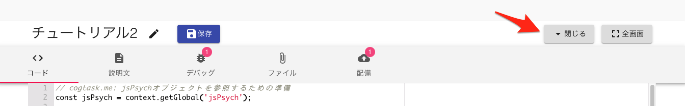

# チュートリアル3: jsPsychによる質問紙作成 (jsPsych v8)

チュートリアル3: jsPsychによる質問紙作成 (jsPsych v8)
[jsPsych](jsPsych.md)を使うと質問紙を簡単に作成することができます。
> 最新版jsPsych(v8)に関する説明です。書き途中です。

# jsPsych Survey Pluginを使う準備
GO-E-MONでjsPsych Survey Pluginを使うためには、以下の**いずれかの**方法でjsPsych Survey Plugin関連ファイルを準備する必要があります。
 [- https://goemon.cloud/t/aTzSoAnzDyQw1TOwPrPn を[タスクのコピー](- https://goemon.cloud/t/aTzSoAnzDyQw1TOwPrPn を[タスクのコピー.md)により複製する] こちらはv7です
または、
 [jsPsych Survey Plugin関連ファイルのアップロード](jsPsych Survey Plugin関連ファイルのアップロード.md)を参考に新規タスクを作成し、関連ファイルをアップロードする - v8はsurvey.cssの取得方法が異なる

# タスク名の設定
タスクの準備をしたら、必要に応じてタスク名を変更します。タスク名右の編集ボタンをクリックします。

タスク名を入力します。タスク名はENTERキーで確定できます。


# コードの記述
タスクとして実行する [JavaScript](JavaScript.md) コードを記述します。ここでは、Survey Plugin https://www.jspsych.org/v8/plugins/survey/ のデモ *Rating and matrix questions for Likert-style scales* 相当のコードを記述します。

以下は  *Rating and matrix questions for Likert-style scales* の例に対してGO-E-MON用の初期化処理を追加したものです。変更点には **// goemon:** というコメントを記載しています。

> 実施したい質問紙の内容に合わせて変更する とコメントを記載した箇所を変更すると、質問項目を変更することができます。

```javascript
  // goemon: jsPsych関係の関数・オブジェクトをスクリプトで利用できるようにします。
  const initJsPsych = context.getGlobal('initJsPsych');
  // Plugin typeごとに以下を定義
  const jsPsychSurvey = context.getGlobal('jsPsychSurvey');
 
  // goemon: jsPsychの表示領域を作る
  const expRoot = $('<div></div>').attr('id', 'exp_main').css({
    height: '80vh',
  });
  context.root.append(expRoot);
  
  /* initialize jsPsych */
  var jsPsych = initJsPsych({
    // goemon: jsPsych用に準備した表示領域に刺激を表示することを示す
    display_element: 'exp_main',
    // goemon: 結果を送信するため、on_finishハンドラには以下のようなコードを記述する。
    // 出力内容は [デバッグ]タブで確認できる。
    // `context.finish('人間が読める結果サマリ', 保存するデータ)`
    on_finish: function(data) {
      context.finish(`回答を受け付けました`, {
        data: data.values(),
      });
    }
  });
  
  /* create timeline */
  var timeline = [];
  
  // Rating and matrix questions for Likert-style scales: https://www.jspsych.org/v8/plugins/survey/
  // 実施したい質問紙の内容に合わせて変更する: ここから
  const trial = {
    type: jsPsychSurvey,
    survey_json: {
     showQuestionNumbers: false,
     title: 'Likert scale examples',
     pages: [
       {
         elements: [
           {
             type: 'rating',
             name: 'like-vegetables',
             title: 'I like to eat vegetables.',
             description: 'Button rating scale with min/max descriptions',
             minRateDescription: 'Strongly Disagree',
             maxRateDescription: 'Strongly Agree',
             displayMode: 'buttons',
             rateValues: [1,2,3,4,5]
           }, 
           {
             type: 'rating',
             name: 'like-cake',
             title: 'I like to eat cake.',
             description: 'Star rating scale with min/max descriptions',
             minRateDescription: 'Strongly Disagree',
             maxRateDescription: 'Strongly Agree',
             rateType: 'stars',
             rateCount: 10,
             rateMax: 10,
           },
           {
             type: 'rating',
             name: 'like-cooking',
             title: 'How much do you enjoy cooking?',
             description: 'Smiley rating scale without min/max descriptions',
             rateType: 'smileys',
             rateCount: 10,
             rateMax: 10,
             scaleColorMode: 'colored',
           }
         ]
       }, {
         elements: [
           {
             type: 'matrix',
             name: 'like-food-matrix',
             title: 'Matrix question for rating mutliple statements on the same scale.',
             alternateRows: true,
             isAllRowRequired: true,
             rows: [
               {text: 'I like to eat vegetables.', value: 'VeggiesTable'},
               {text: 'I like to eat fruit.', value: 'FruitTable'},
               {text: 'I like to eat cake.', value: 'CakeTable'},
               {text: 'I like to cook.', value: 'CookTable'},
             ],
             columns: [{
               "value": 5,
               "text": "Strongly agree"
             }, {
               "value": 4,
               "text": "Agree"
             }, {
               "value": 3,
               "text": "Neutral"
             }, {
               "value": 2,
               "text": "Disagree"
             }, {
               "value": 1,
               "text": "Strongly disagree"
             }]
           }
         ]
       }
     ]  
    }
 
  };
  // 実施したい質問紙の内容に合わせて変更する: ここまで
  timeline.push(trial);
 
  // goemon: 上部メニューを隠す
  context.appMenu.hide();
  jsPsych.run(timeline);


```
## コードの実行
コードを記述したら、実行してみましょう。


GO-E-MONのエディタが邪魔で*はじめる*ボタンが見えない場合は、*閉じる* ボタンを押してみてください。



*はじめる*をクリックするとタスクが開始されます。実行画面は以下のようになります。


## コードの動作確認
タスクを最後まで実施したら、どのようなログが送信されたか確認してみましょう。*デバッグ*タブから確認することができます。


送信されたログは *スクリプトを終了しました* ログから内容を確認できます。
また、スクリプトの誤りなどでエラーが発生した場合は、デバッグタブから警告・エラーを確認することができます。

# 説明文の設定
説明文にはタスクの説明を記述することができます。*説明文* タブに以下の文字列を記述します。説明文の記述には[Markdown](Markdown.md)を使用することができます。

```markdown
 [jsPsych](https://www.jspsych.org/)のSurvey Pluginを
 GO-E-MONで実行する例です。
 
 [チュートリアル3: jsPsychによる質問紙作成](https://scrapbox.io/cogtask-me/%E3%83%81%E3%83%A5%E3%83%BC%E3%83%88%E3%83%AA%E3%82%A2%E3%83%AB3:_jsPsych%E3%81%AB%E3%82%88%E3%82%8B%E8%B3%AA%E5%95%8F%E7%B4%99%E4%BD%9C%E6%88%90)で紹介しているサンプルです。
  
 紹介文はMarkdownで記述することができます。**太字**や*斜体*などをテキストにより記述することができます。

```
すると、開始時の画面に以下のように説明文を表示することができます。あらかじめ実施に必要な注意事項などを記載するのに利用してください。


# 配備
以上でタスクに必要な情報は定義できました。
ただし、このままではタスク作成者しか試すことはできません。作成したタスクを他のユーザからも参照できるようにすることを*配備*と呼びます。

*配備*タブの*配備*ボタンを押すことで、タスク作成者以外のユーザが最新のタスクを試すことができるようになります。


*配備*を実施したら、タスクへの参加 に記載されているURLか、QRコードをユーザーに配布してください。これにより、ユーザーはこのタスクを実施することができるようになります。

> タスクのJavaScriptや説明文を変更したあとは、必ず配備ボタンを押して他のユーザーにも最新版を参照できるようにする必要があります。


# 実施確認
タスクがユーザーにより実施されると、タスク提供者のPersonaryに実施記録が格納されます。Personaryを自身のアカウントと紐付けていると、以下のように実施記録が送信されます。Personaryのデータ分析については[Jupyter NotebookでPersonaryのデータを分析する](Jupyter NotebookでPersonaryのデータを分析する.md)を参照してください。
