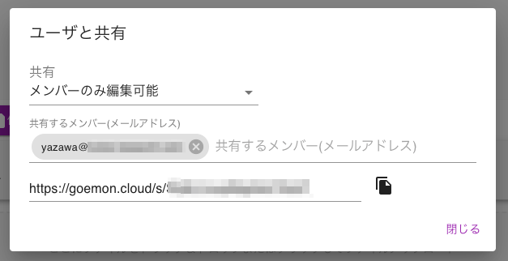

# 共有機能

共有機能
GO-E-MONタスクを複数人で共有し、編集することができます。共有機能を使用する際にはタスクエディタの **共有** ボタンを利用してください。

タスクはデフォルトでは共有不可です。メンバーのみ編集可能 または リンクを知っている誰もが編集可能 を選択することができます。

メンバーのみ編集可能を選択した場合は、共有相手としたいユーザのメールアドレス(GO-E-MONへのログインに使用しているもの)を入力してください。その後、共有したいユーザに共有URLを送り、開いてもらうようにしてください。

> なお、共有URLを用いた同時編集には注意してください。2022/2現在は競合のチェックなどは行っていないため、最後に保存したユーザのデータがタスクデータとして採用されます。
