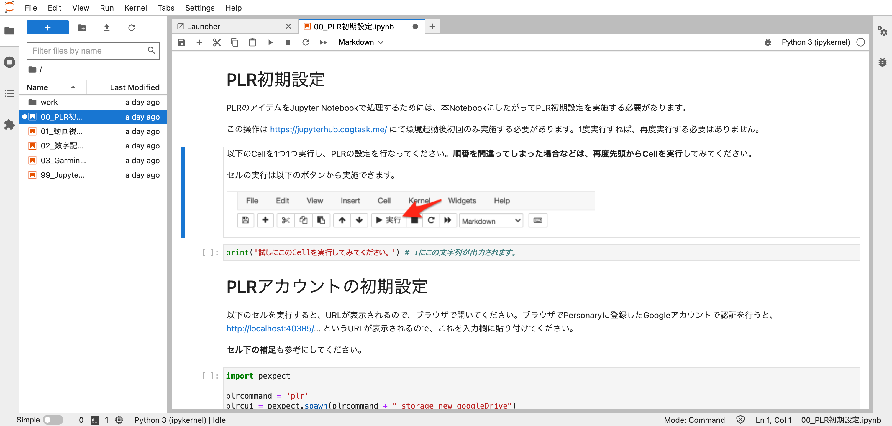

# 分析環境の起動(Docker)

分析環境の起動(Docker)
分析環境はDocker <https://www.docker.com/products/docker-desktop> というソフトウェアを利用することで実行することができます。

1. Docker Desktop <https://www.docker.com/products/docker-desktop> をインストールする
2. ターミナルから以下のコマンドを実行する

```terminal
 $ docker run -it --name jupyter-plr -p 8888:8888 asia-northeast1-docker.pkg.dev/cog-pds-plr/plr/notebook:latest

```
3. ターミナルに以下のようなURLが出力されるので、ブラウザでこのURLを開く
<http://127.0.0.1:8888/?token=XXXXXXXXXXXXXXXXXXXXXXXXXXXXXXXX>

上記の手順を実施すると、以下のようなJupyterLabの画面が表示されます。 [分析環境の利用](分析環境の利用.md) を参考に実行してください。



このようにすると、PC上でJupyter Notebookを利用することができます。使い終わったら、2.のターミナルを Control + C キーで中断します。

> この方法で起動した場合はデータはコンテナとして保持されます。停止後は、docker start jupyter-plr でコンテナを再起動できます。

#Personary分析環境

---

← 戻る: [Jupyter NotebookでPersonaryのデータを分析する](Jupyter_NotebookでPersonaryのデータを分析する.md) | [分析環境の起動(NII GakuNin RDM データ解析機能)](分析環境の起動(NII_GakuNin_RDM_データ解析機能).md)