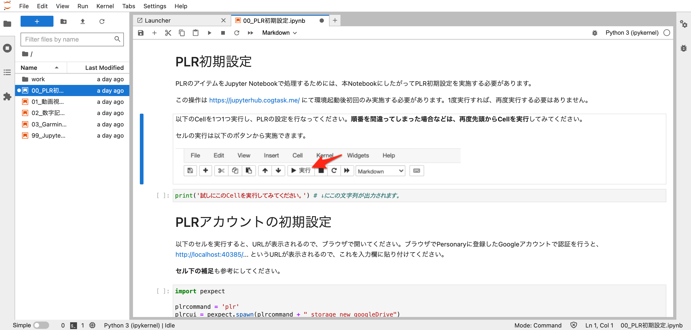

# 分析環境の起動(NII GakuNin RDM データ解析機能)

分析環境の起動(NII GakuNin RDM データ解析機能)
国立情報学研究所(NII)が提供するGakuNin RDM データ解析機能 https://support.rdm.nii.ac.jp/usermanual/DataAnalysis-01/ を利用することで、 [分析環境の起動(Docker)](分析環境の起動(Docker).md) のように自身で計算機環境を準備しなくても、Personaryの分析環境を利用することができます。

> GakuNin RDMのサービスを利用する場合は利用規約 https://support.rdm.nii.ac.jp/terms/ を確認の上、実施者の責任でご利用ください。

事前にアカウントが使用可能かどうかは https://rdm.nii.ac.jp と https://jupyter.cs.rcos.nii.ac.jp にログインできるかどうかで確認できます。ログインはいずれも学認による認証 https://www.gakunin.jp/fed でおこないます。

1. GakuNin RDMにログインする https://rdm.nii.ac.jp  (GakuNin RDMユーザーマニュアル: https://support.rdm.nii.ac.jp/usermanual/LogInAndOut-02/ )
2. GakuNin RDMでプロジェクトを作成する (GakuNin RDMユーザーマニュアル: https://support.rdm.nii.ac.jp/usermanual/Project-02/ )
3. プロジェクト 2. を開き、データ解析機能を有効化する (GakuNin RDMユーザーマニュアル: https://support.rdm.nii.ac.jp/usermanual/DataAnalysis-02/ )

4. NII Storage 配下に、 .binder フォルダを新規作成する(頭のドット . を忘れないようにしてください)

5. Dockerfile https://gist.github.com/yacchin1205/2177d2c4a0d7cc80ab59d6f8a1088a24 をダウンロードし、ドラッグアンドドロップ操作により、NII Storage中の.binderフォルダにアップロードする (以下のように NII Storage/.binderにDockerfileが配置された状態にします)

6. 解析タブを開く (GakuNin RDMユーザーマニュアル: https://support.rdm.nii.ac.jp/usermanual/DataAnalysis-02/ )
7. 解析基盤へのログインを求められるので、自身がアカウントを持つ所属機関を選択する

8. 新しい解析環境を作成 をクリックする - この時、Dockerfileのリセットは選択しないでください

上記の手順を実施すると、以下のようなJupyterLabの画面が表示されます。 [分析環境の利用](分析環境の利用.md)(分析環境の利用.md) を参考に実行してください。

