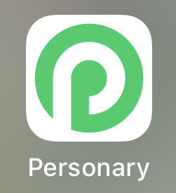
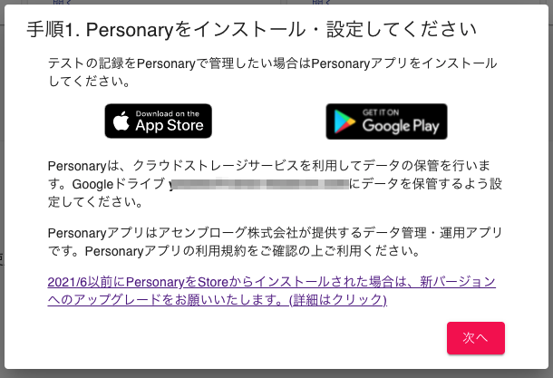

# 旧Personaryから新Personaryへの移行

旧Personaryから新Personaryへの移行
App Store, Play Storeともに、2021年6月ごろまで配布されていたPersonaryは配布が停止され、Personary 2021となります。**古いバージョンではフレンド登録できない問題があります**ので、新しいバージョンへのアップグレードをお願いいたします。
**古いバージョン**のPersonaryのアイコン:

**新しいバージョン**のPersonaryのアイコン:

# アップグレード手順
更新手順は以下の通りです。
Personaryはパスフレーズを忘れてしまうとアカウントの紐付けが不可能になります。古いバージョンのPersonaryは（すでにアカウント設定がなされている場合、）パスフレーズを変更する機能がありますので、**パスフレーズを思い出せない時用に、アップグレードが終わるまで古いバージョンのPersonaryを残しておく**ことがポイントです。

- 1. 新しいバージョンのPersonaryをインストールする
- 2. 新しいバージョンのPersonaryにアカウントを設定する(パスフレーズを忘れてしまった場合、古いバージョンでパスフレーズを設定し直す)
- 3. 古いバージョンのPersonaryをアンインストールする

# 1. 新しいバージョンのPersonaryをインストールする
スマートフォン等で https://cogtask.me のPersonary同期設定を開く。

*次へ* ボタンを押し、*手順1. Personaryをインストール・設定してください* ダイアログ内の App StoreまたはPlay Store へのリンクを開く。

アプリをインストールする。以下のような新バージョンのPersonaryがインストールされれば成功です。

# 2. 新しいバージョンのPersonaryにアカウントを設定する
新しいバージョンのPersonaryを開くと、Googleのログインボタンが表示されるので、https://cogtask.me を使用しているGoogleアカウントでログインする。
Googleの権限について確認がなされたのち、パスフレーズを聞かれる。この時、
**古いバージョンで入力したPersonaryのパスフレーズを覚えている場合**
→ それを入力する。
**古いバージョンで入力したPersonaryのパスフレーズを覚えていないか、入力しても失敗する場合**
→ 以前のパスフレーズを確認することはできないので、新たなパスフレーズを再設定する。
パスフレーズを再設定したい場合、古いバージョンのPersonaryを起動し、*アカウント登録* 画面を開く。

パスフレーズの編集ボタンを押す。

パスフレーズの入力を求めてくるので、新しくパスフレーズを考えて（これは忘れないようにすること）、入力する。

OKを押してパスフレーズの再設定は完了です。**上記に入力したパスフレーズを新しいバージョンのPersonaryに入力**して、設定を完了してください。

# 3. 古いバージョンのPersonaryをアンインストールする
新しいバージョンのPersonary上で自身のアカウントのチャネル等が表示できることが確認できれば、アカウントの設定は完了です。
古いバージョンのPersonaryは不要ですので、アプリは削除してください。

#Personary
